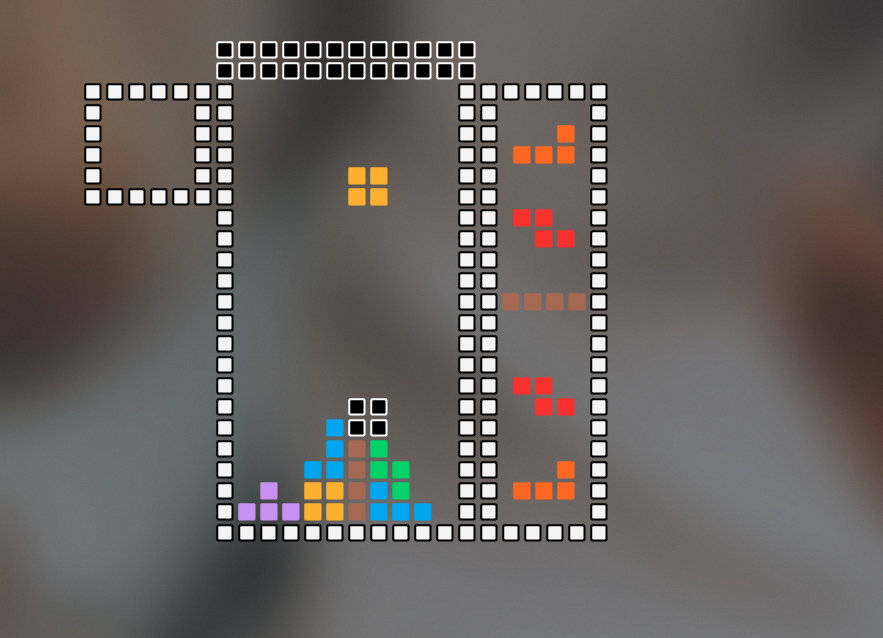

# cpp-tetris



Tetris created using C++.

### Change compile flag that "include path".
```Makefile
INCPATH=-I [Your clone directory root]
```

### And you can change optimization flag as you wish.
```Makefile
FLAGS=-std=c++20 -g2 -Wall -Wextra -Werror -o $(TARGET) $(INCPATH)
#               --\/--
FLAGS=-std=c++20 -O2 -Wall -Wextra -Werror -o $(TARGET) $(INCPATH)
```

### And make it!
```zsh
make [ all | re | clean ]
```
